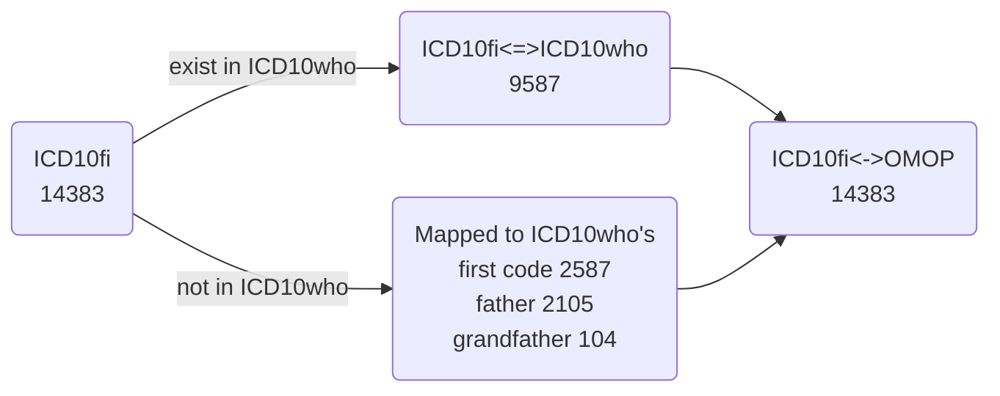
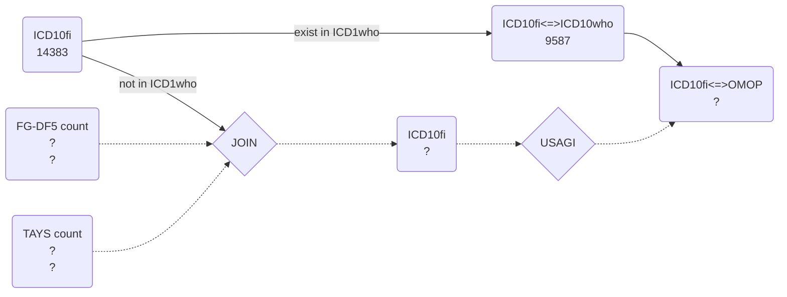

# NAME

# Intro

**Summary ICD10fi coding marks**

In the Finnish version of the ICD10 there are two types of additional codes.

- Classification codes: decrive ranges of codes other than the conventional ICD10 herarchy
    - `Code1-Code2` : from Code1 to Code2
- Reason codes: combine codes to add more info on what caused the diagnose, there are 4 marks
   - `Code1*Code2` : ”Oirekoodi”, Code2 indicates an additional symtom
   - `Code1+Code2` : ”Syykoodi”, Code2 indicates the reason for Code1
   - `Code1#Code2` : ATC-koodi, Code2 is and ATC code indicating the medicine that caused Code1
   - `Code1&Code2` : ”Kasvainkoodi”, Code2 is and endocrinological disorder code that caused Code1

# Mapping process
In short, ICD10fi codes are matched to the  ICD10who. If not match is found the second code or last digit are removed util they match.

**ATM:**

**TODO:**

## In `1_source_files`
ICD10fi standard `58_1471433699473.txt` downloaded from [kodistopalvelu](https://91.202.112.142/codeserver/pages/classification-view-page.xhtml?classificationKey=23).

ICD10who extracted from the table `CONCEPTS` in the OMOP vocabularies using `extract_ICD10who_from_OMOP.R`.

# #In 2_mapping_process
Detailed in `auto_mapping_ICD10fi_to_ICD10who.rmd/md`

1. Ignore the new ICD10fi classification codes, these are not suppose to be used as diagnose
2. Match ICD10fi to ICD10who only based on the diagnose code `CodeA`
3. These new ICD10fi that don't exist in ICD10who, match to the parent code

## In 3_mapping_tables
TODO: tables sent to Athena

# NOTES:
Not all the union codes are in the icd10fi table column CodeId. 

But rules on how to make them are in the `ALONG:Huom.` column. In text format !!

FIX: These union codes in CodeId we map them. These that are not there, at the end of the process we extend the table and duplicate names and map to 2 codes. In the ELT process we create two codes with same source code but different mapping. 

