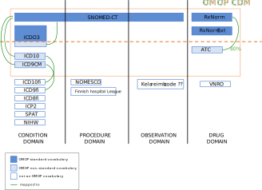
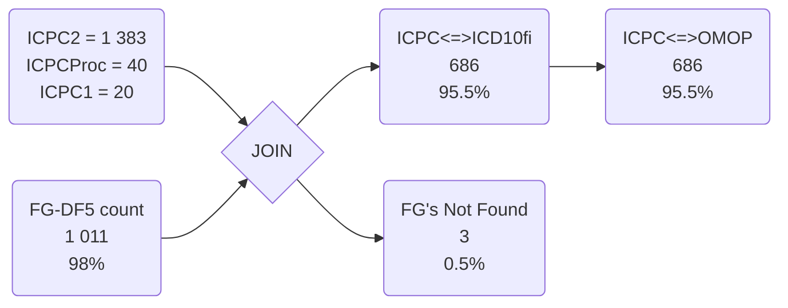
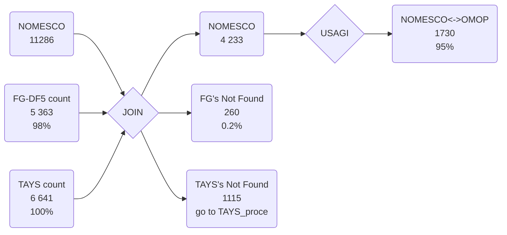
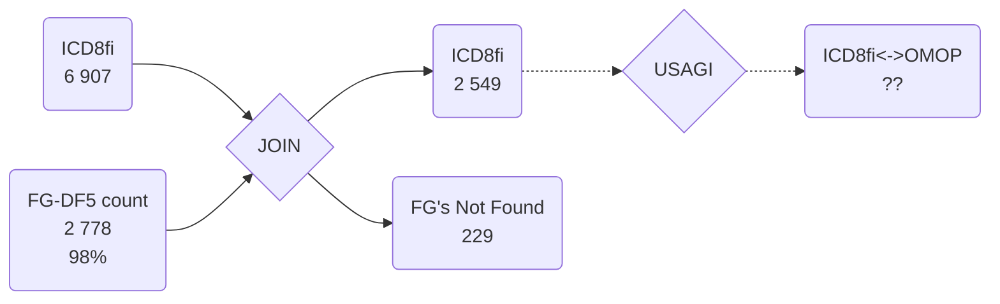
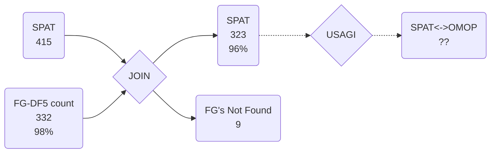
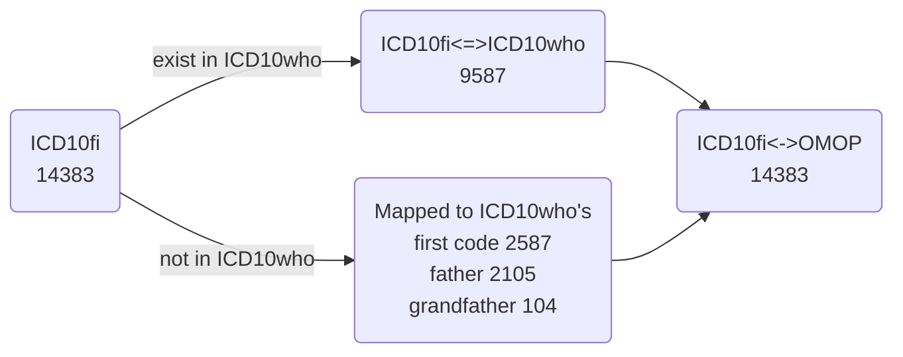
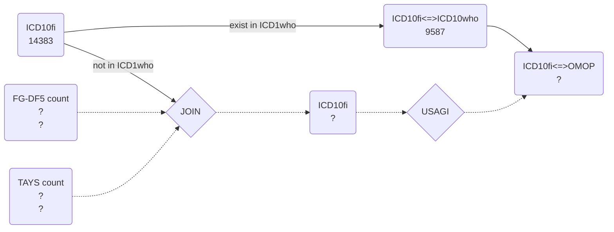
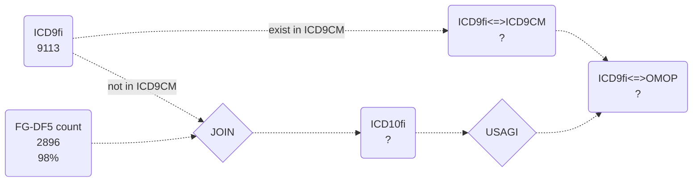

# Mapping Finnish codes to the OMOP common data model
## Intro
The [ observational medical outcomes partnership (OMOP) common data model (CDM)](https://www.ohdsi.org/) is gaining interest in Finland.
The most laborious task will be mapping and curating the medical vocabularies specific from Finland to the standard codes in the OMOP CDM but once done these mapping can be used in the hole country and some Nordic neighbors.

This folder contains the codes to create the mapping tables between the Finnish vocabulary used in the FinnGen project and the standard vocabularies used in the OMOP CDM.  
This will benefit not only FinnGen but other projects in Finland. For this reason, a similar project was started in a public [GitHub repo](https://github.com/javier-gracia-tabuenca-tuni/mapping_finland), but now it is here as many vocabularies are private.

**Background**
Rather than create a completely new vocabulary the OMOP CDM proposes to use existing vocabularies, these are named standard vocabularies. The OMOP CDM also includes many other vocabularies which are mapped to the standard vocabularies. All the vocabularies used by the OMOP CDM and their connexons are available in [Athena](http://athena.ohdsi.org/).    
In short, mapping means to connecting the codes from a non-standard vocabulary to the corresponding codes in the standard vocabulary. Details of the process can be found [here](https://www.ohdsi.org/web/wiki/doku.php?id=documentation:vocabulary:introduction)

Vocabularies are organized into in medical domains. One vocabulary may cover more than one domain  ([see here](https://www.ohdsi.org/web/wiki/doku.php?id=documentation:vocabulary:domains_and_vocabularies)).

Following picture shows the vocabularies and domains relevant to the FinnGen longitudinal data.

**Aim**
The aim of this project is to convert the `not an OMOP vocabulary` to a `OMOP non-standard vocabulary` `mapped to` the corresponding `OMOP standard vocabulary`.

The resulting mapping tables will be included in the OMOP CDM, as suggested in this [forum question](https://forums.ohdsi.org/t/creating-new-vocabularies/9929/2), and the process published as done for other vocabularies ([e.g. ICD10](https://www.ohdsi.org/web/wiki/doku.php?id=documentation:vocabulary:icd10)).

**Tools**
USAGI is a java tool provide by OHDSI that helps in mapping process of new vocabularies [here](https://github.com/OHDSI/Usagi)

## Summary of progress

|     | Vocabulary       | N_codes     | Method         |  %_codes  | FG-DF5 %_events | TAYS %_events |
| --- | ---------------- | ----------- | -------------- |:---------:|:---------------:|:-------------:|
|     | **Condition**    |             |                |           |                 |               |
| [1] | ICD10fi          | 14383       | ICD10who+USAGI | 66%(100%) |     ?(98%)      |       ?       |
| [2] | ICD9fi           | 9113        | ICD9CM+USAGI?  |  ?(100%)  |     ?(98%)      |       -       |
| [3] | ICD8fi           | 6907 [2778] | USAGI          |    0%     |       0%        |       -       |
| [x] | ICP2             | 1443 [1011] | ICD10who       |   47.5%   |     95.56%      |       -       |
| [?] | NIHV             | ?           | ?              |    0%     |       0%        |       -       |
| [x] | ICDO3            |             | Exist          |   100%    |       98%       |       ?       |
| [ ] | REIMB            | 116         | USAGI          |     0     |       0%        |       -       |
|     | **Procedure**    |             |                |           |                 |               |
| [x] | NOMESCO          | 11281       | USAGI          |    15%    |       95%       |      95%      |
| [6] | FHL              | 2240        | USAGI          |     0     |       0%        |       -       |
| [1] | TAYS_proce       | ?           | USAGI          |     ?     |        -        |       ?       |
|     | **Observation**  |             |                |           |                 |               |
| [?] | SPAT             | 415 [332]   | USAGI          |    0%     |       0%        |       -       |
|     | **Drug**         |             |                |           |                 |               |
| [x] | ATC              | ?           | Exist          | 80%(100%) |    80%(99%)     |       ?       |
| [0] | VNRO             | ?           | code+USAGI ??  |     0     |       0%        |       ?       |
|     | **Measurements** |             |                |           |                 |               |
| [x] | LAB              | ?           | USAGI          |     ?     |        -        |       ?       |

## Mapping process by source vocabulary

4 different ways

---

### A: already mapped
#### [x] ATC
 100% Mapped to OMOP. **!!! But only 80% mapped to standard !!!**
#### [x] ICDO3
Is a OMOP standard vocabulary

---

### B: Other_vocab
#### [x] ICPC

---

### C: USAGI

#### [x] NOMESCO

#### [ ] ICD8fi

#### [ ] SPAT

#### [x] LAB

#### [x] TAYS_proce

#### [] REIMB
Missing table

---

### D: Other_vocab + USAGI

### ICD10fi
**ATM:**

**TODO:**

### ICD9fi
**MAYBE:**

## ICD10fi
ICD10fi is an extension of the [ICD10who](https://icd.who.int/browse10/2016/en#/F20.0). ICD10fi codes with Finnish and English names available [at THL](https://91.202.112.142/codeserver/pages/publication-view-page.xhtml?distributionKey=9394&versionKey=58&returnLink=fromVersionPublicationList)

### ICD9fi
ICD9fi is an extension of the [ICD9CM](https://en.wikipedia.org/wiki/List_of_ICD-9_codes).

ICD9fi codes with Finnish names available [at THL in pdf](https://www.julkari.fi/handle/10024/131850).

For a table version check the [wiki](../-/wikis/home).

**DONE:**
1. Programmatically match the ICD10who to the ICD10fi by code. When no match, match to the father code.

**TODO:**

1. Manually double check that the names of the programmatically matched codes also fit.
1. Manually match these that were programmatically matched to the parent.

Use USAGI for these that don't match code nor name.  

### ICD8

### ICP2

### SPAT

### NIHV

### ICDO3
Coding system specific for oncology. International Classification of Diseases for Oncology, 3rd Edition (ICD-O-3).
[WHO](https://www.who.int/classifications/icd/adaptations/oncology/en/)

This vocabulary, is completely mapped in to the OMOP. More specifically, ~75% of the codes are used as `OMOP standard vocabulary` and the other ~25% as `OMOP non-standard vocabulary` mapped to SNOMED-CT.

## Procedure domain
The main `OMOP standard vocabulary` is SNOMED-CT.

### THL toimenpideluokitus (NOMESCO ??)
The procedure classification is based on the NCSP Nordic Classification of Surgical Procedures, first published in 1996. The NCSP classification is maintained by the Nordic Classification Center (NCC) and is copyrighted by NOMESKO [ref](
https://koodistopalvelu.kanta.fi/codeserver/pages/classification-view-page.xhtml?classificationKey=57&versionKey=119)

THL provides table with codes linked to English names, NOT all have it!!

==QUESTION: so,  is this the same as NOMESCO ??==

**DONE:**
- 1% mapped to SNOMED-CT by a Swedish group [here](https://forums.ohdsi.org/t/nomesco-procedure-codes-to-SNOMED-CT/1544/4)

**TODO:**
1. USAGI for English name matches.  

### Finnish hospital league

## Onservation domain ??

### Lääkekorvauksetkodit REIMB
Reimbursement of drugs codes [codes](https://www.kela.fi/laakkeet-ja-laakekorvaukset_erityiskorvaus)

**At the moment :**
Map to SNOMED observations ?? for example "history of" and "history of use of" ??

==**QUESTION:**
May be these should be mapped to the condition domain !! [I asked in the forums](https://forums.ohdsi.org/t/how-to-map-a-country-specific-reimburesement-codes-to-the-cdm/9148)
Because most of the REIMB event also have a ICD10 or ICD9 code !!==

## Drug Domain
The `OMOP standard vocabulary` are the RxNorm and the RxNorm-Extension. ATC is used as a classification vocabulary, but not as a standard.  

### ATC
ATC are currently mapped to RxNorm up to the 4th ATC level.
However, some the 5th level ATC codes ambiguous to RxNorm. This is being solved [OHDSI working group](https://forums.ohdsi.org/t/atc-working-group-meeting-agenda-and-minutes/4394/2).  

### VNRO
The Nordic Article Number (Vnr) is an identification code for a specific article of medicine with marketing authorisation in the Nordic countries [ref](https://wiki.vnr.fi/?page_id=36)

There is a table linking the codes to names, dosage, via, and more. Also the ATC code of the group. Check the [wiki](../-/wikis/home).

**DONE:**

**TODO:**
1. Programmatically match the dosage, via, and name to RxNorm.
2. Match the string to the RxNorm names, double check using the ATC code.
3. Manually curate these that match the code but not the name.
hola
