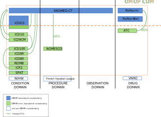

Mapping Finland
================

  - [Mapping Finnish codes to the OMOP common data
    model](#mapping-finnish-codes-to-the-omop-common-data-model)
      - [Intro](#intro)
      - [Summary of progress](#summary-of-progress)

# Mapping Finnish codes to the OMOP common data model

## Intro

The [observational medical outcomes partnership (OMOP) common data model
(CDM)](https://www.ohdsi.org/) is gaining interest in Finland. The most
laborious task will be mapping and curating the medical vocabularies
specific from Finland to the standard codes in the OMOP CDM but once
done these mapping can be used in the hole country and some Nordic
neighbors.

This folder contains the codes to create the mapping tables between the
Finnish vocabulary used in the FinnGen project and the standard
vocabularies used in the OMOP CDM.  
This will benefit not only FinnGen but other projects in Finland. For
this reason, a similar project was started in a public [GitHub
repo](https://github.com/javier-gracia-tabuenca-tuni/mapping_finland),
but now it is here as many vocabularies are private.

**Background** Rather than create a completely new vocabulary the OMOP
CDM proposes to use existing vocabularies, these are named standard
vocabularies. The OMOP CDM also includes many other vocabularies which
are mapped to the standard vocabularies. All the vocabularies used by
the OMOP CDM and their connexons are available in
[Athena](http://athena.ohdsi.org/).  
In short, mapping means to connecting the codes from a non-standard
vocabulary to the corresponding codes in the standard vocabulary.
Details of the process can be found
[here](https://www.ohdsi.org/web/wiki/doku.php?id=documentation:vocabulary:introduction)

Vocabularies are organized into in medical domains. One vocabulary may
cover more than one domain ([see
here](https://www.ohdsi.org/web/wiki/doku.php?id=documentation:vocabulary:domains_and_vocabularies)).

Following picture shows the vocabularies and domains relevant to the
FinnGen longitudinal data.

**Aim** The aim of this project is to convert the `not an OMOP
vocabulary` to a `OMOP non-standard vocabulary` `mapped to` the
corresponding `OMOP standard vocabulary`.

The resulting mapping tables will be included in the OMOP CDM, as
suggested in this [forum
question](https://forums.ohdsi.org/t/creating-new-vocabularies/9929/2),
and the process published as done for other vocabularies
([e.g. ICD10](https://www.ohdsi.org/web/wiki/doku.php?id=documentation:vocabulary:icd10)).

**Tools** USAGI is a java tool provide by OHDSI that helps in mapping
process of new vocabularies [here](https://github.com/OHDSI/Usagi)

## Summary of progress

| vocabulary                                          | n\_codes | mapped | mapping\_method  | FinnGen\_DF5                                                                                                     | TAYS\_oncology                                                                                                  |
| :-------------------------------------------------- | :------- | :----- | :--------------- | :--------------------------------------------------------------------------------------------------------------- | :-------------------------------------------------------------------------------------------------------------- |
| [ATC](./ATC/)                                       | 6211     | 69%    | Done by OMOP     | 95.2% 3.0% 1.6%  | 94.3% 3.7% 1.9% |
| [ICDO3](./ICDO3/)                                   | 63666    | 100%   | Done by OMOP     | 97.3% 2.6%                                        |                                                                                                                 |
| [ICD10fi](./ICD10fi/)                               | 68482    | 83%    | ICD10who + USAGI | 98.8% 0.9% 0.2%  | 96.3% 1.6% 2.0% |
| [ICD9fi](./ICD9fi/)                                 | 2855     | 23%    | USAGI            | 74.7% 23.4% 1.7% |                                                                                                                 |
| [ICPC2](./ICPC2/)                                   | 1443     | 77%    | ICD10who         | 87.2% 12.1% 0.5% |                                                                                                                 |
| [NOMESCO](./NOMESCO/)                               | 11275    | 16%    | USAGI            | 89.0% 10.3% 0.5% | 96.7% 3.2% 0.0% |
| [REIMB](./REIMB/)                                   | 264      | 0%     | TODO:USAGI       | 100.0%                                                                          |                                                                                                                 |
| [ICD8fi](./ICD8fi/)                                 | 6907     | 0%     | TODO:USAGI       | 98.0% 1.9%                                       |                                                                                                                 |
| [SPAT](./SPAT/)                                     | 415      | 0%     | TODO:USAGI       | 99.9% 0.0%                                       |                                                                                                                 |
| [Dental codes (NIHW)](./Dental%20codes%20\(NIHW\)/) |          |        | TODO             |                                                                                                                  |                                                                                                                 |
| [FHL](./FHL/)                                       |          |        | TODO             |                                                                                                                  |                                                                                                                 |
| [lab\_tampere](./lab_tampere/)                      | 2839     | 23%    | USAGI            |                                                                                                                  | 87.8% 12.1%                                    |

**Table:** Percentage in sources as: percent of
events mapped to standard vocabulary;
not mapped to standard vocabulary ;
not found in vocabulary
